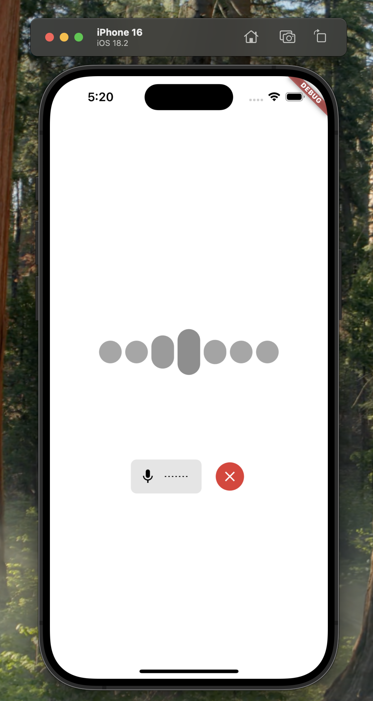

# Jarvis - Flutter Voice Assistant

An intelligent voice assistant app built with Flutter and powered by LiveKit's real-time communication platform. Talk to an AI assistant using natural voice commands and receive spoken responses.



## ✨ Features

- **Voice Interaction**: Seamless voice-based conversations with AI assistants
- **Real-time Transcription**: See your conversations as they happen
- **Multi-platform Support**: Works on iOS, Android, macOS, and web
- **Recording History**: Access your past conversations
- **Dark/Light Theme**: Automatic theme based on system preferences
- **Open Source**: Fully customizable for your specific needs

## 🚀 Quick Start

### Prerequisites
- Flutter SDK (latest stable version)
- LiveKit account (free tier available)
- For iOS: Xcode with valid signing certificates
- For Android: Android Studio

### Installation

1. **Clone the repository**
   ```bash
   git clone https://github.com/yourusername/jarvis.git
   cd jarvis
   ```

2. **Setup LiveKit integration**

   Option 1: Using LiveKit CLI (recommended)
   ```bash
   # Install LiveKit CLI if you don't have it
   npm install -g livekit-cli
   
   # Create a new project with your sandbox token
   lk app create --template voice-assistant-flutter --sandbox <your_token_server_id>
   ```

   Option 2: Manual setup
   - Create a `.env` file in the project root with your LiveKit Sandbox ID:
     ```
     LIVEKIT_SANDBOX_ID=<your_sandbox_id>
     ```
   - Or update `token_service.dart` with your URL and token

3. **Install dependencies and run**
   ```bash
   flutter pub get
   flutter run
   ```
## 🔑 Production Deployment

For production environments:

1. Implement a proper token generation service for authentication
2. Disable the sandbox token server
3. Modify `token_service.dart` to communicate with your token server
4. Follow the [LiveKit token generation guide](https://docs.livekit.io/home/server/generating-tokens/)

## 🔧 Customization

The app uses Material Design with a purple color scheme and responsive layout. Customize the UI by:

1. Modifying the theme in `main.dart`
2. Updating UI components in the `widgets` directory
3. Extending functionality in the `services` directory

## 🤝 Contributing

Contributions are welcome! To contribute:

1. Fork the repository
2. Create your feature branch (`git checkout -b feature/amazing-feature`)
3. Commit your changes (`git commit -m 'Add some amazing feature'`)
4. Push to the branch (`git push origin feature/amazing-feature`)
5. Open a Pull Request
